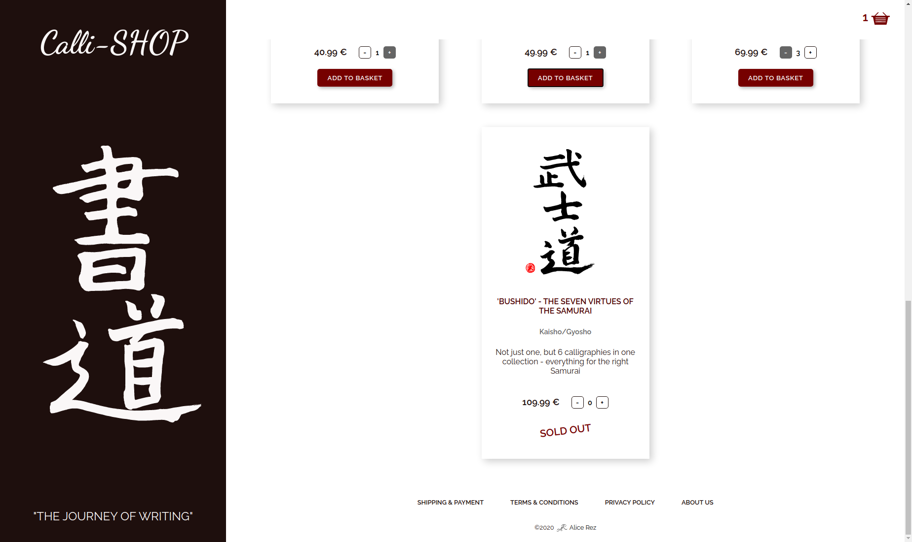

<h1> </h1>

"Make somebody happy with our calligraphy"

Explore [Live demo](https://callishop.alice-rez.vercel.app/) or look at previews in [Gallery](#gallery)

## Description

Mock up of the e-shop selling calligraphies - project created at the end of the React module of my one year web development course. Just frontend application without server or database, so the order is not in reality send anywhere, but posses all basic functionalities of small e-shop with shopping without registration:

- user can choose quantity and add product to the basket

- user can choose just as much quantity as is available. Not available items are depicted by "Sold out" tag.

- in the basket they can also change quantities of the products or delete the whole basket item

- when product called "Customized names" is add to the basket, form for adding details such as which name should be written and if it should be written individually or added to one of the calligraphies appears (the options for choosing where the names will be written corresponds to items added to the basket - just the ones that have possibility to add name - as is written in product description in shop part - is displayed in select)

- user can go through the steps of the order - add personal information and choose shipping and payment option (cash payment option can be chosen just together with picking order personally in the shop)

- all forms have implemented basic validation

- user can go back in the order without necessity to fill the data once again

- at the end, user can see the summary of the whole order (where is also written, which name and for what calligraphy was added - if added) and "send it"

- the basket is emptied after sending the order, as well as the info about order in redux store

- for the demo purpose, the personal part of the order form as well as shipping/payment options are pre-filled to make exploration of the page easier for anybody - but definitely it is possible to change it

## Setup

1. Clone repository
2. ```
   cd <your-repository-name>
   npm install
   ```
3. ```
   npm start
   ```
4. Enjoy

## Implementation

**Used technologies**: React, Create React App, React Router, functional components, React Hooks, Redux, React-redux, CSS-in-JS, Styled Components, CSS variables, SVG

For the project configuration was used Create React App package. App state management is done using by Redux, for styling were used Styled Components. Calligraphies are my own handwork (all rights reserved!), just scanned and transformed to SVG.

## License

Source code is under the [MIT](./LICENSE) license. **All rights to calligraphy graphics (SVG) are reserved!**

## Gallery

**Fig.1** : Overall look at e-shop when entering the site


</br>
</br>
</br>

**Fig.2** : Lower part of the main page with depicting of the sold out product as well as with secondary navigation



</br>
</br>
</br>
